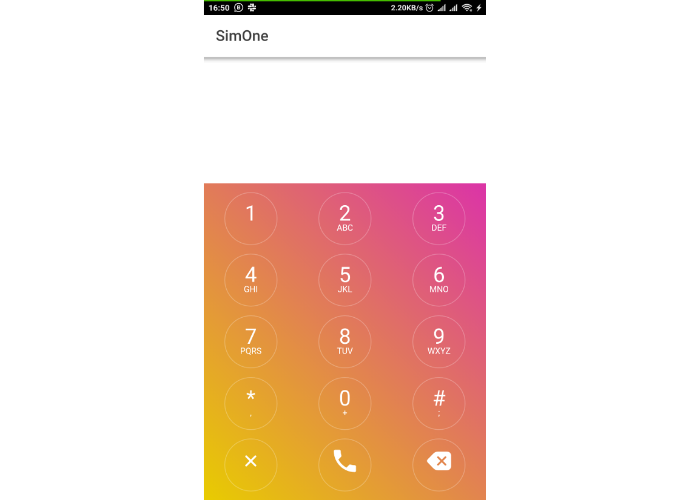

# USSD Simulator

USSD Simulator is a tool that helps developers test USSD applications during 
development and testing phase. 

It simulates the phone interface or dialer interface of mobile devices. Users 
can simply test their apps by dialing a USSD code and the simulator initiates 
a USSD session by calling an already defined endpoint. 

### Legacy Dialer Screen

The problems that USSD Simulator seeks to solve are multi-faceted:
+ You no longer need to use ngrok to other software to test your software
+ Testing can be done locally
+ No network connection is required
+ Intuitive feel

### Installation

Currently, the project is still in development.

New release will be available on Google Play Store and Apple App Store
