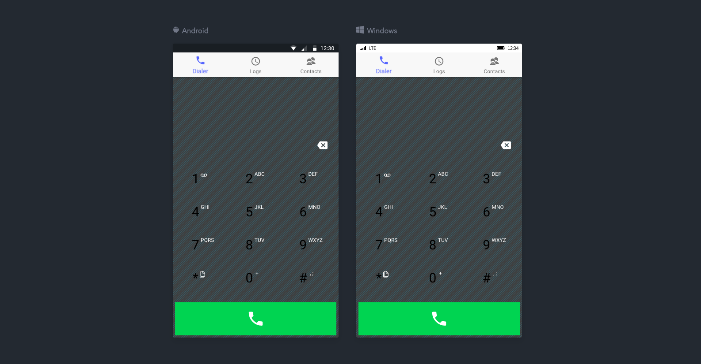

# SimOne

SimOne is a USSD simulator that helps developers test USSD applications during 
development and testing phase. 

It simulates the phone or dialer interface of mobile devices. Users 
can simply test their apps by dialing a USSD code and the simulator initiates 
a USSD session by calling an already defined endpoint. 

### SimOne Screen

### SimOne Legacy Screen

The problems that SimOne seeks to solve are multi-faceted:
+ You no longer need to use ngrok or other software to test your USSD
+ Testing can be done locally
+ No network connection is required
+ Intuitive feel

### Installation

Currently, the project is still in development.

New release will be available on Google Play Store and Apple App Store
